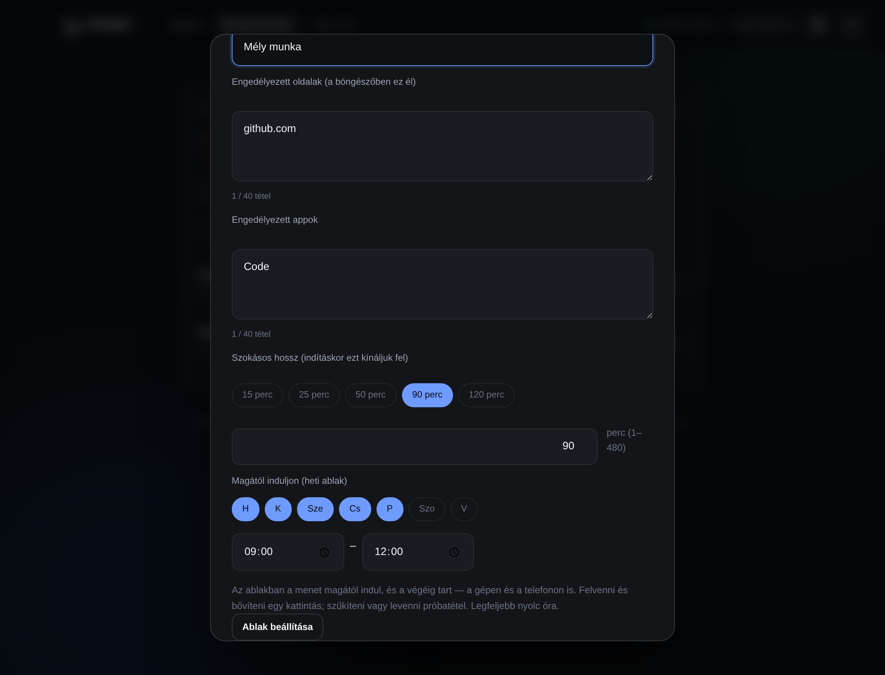

# Funkcióterv: munkamenetek („most csak ez mehet”)

Státusz: **kész az asztali appon** — csomagok, gyorsbillentyűs réteg, és a
fehérlista érvényesítése a böngészőben. Az appok engedélyezése egyelőre
figyelmeztet, nem tilt; a dokumentum alja megmondja, miért.

## Mit old meg

A blokklista arról szól, mi NE menjen. Van azonban egy másik igény, ami
ellentétes irányból közelít:

> Leülök nyelvet tanulni, és a következő ötven percben csak a szótár és a
> jegyzetfüzet kell.

Mindent felsorolni, ami zavarhat, reménytelen — a világon minden zavarhat.
Felsorolni, ami kell: öt tétel. A munkamenet ezért **fehérlista**.

```
„Nyelvtanulás”   engedve: translate.google.com, quizlet.com, Word
                 minden más: tiltva, ötven percig
```

## Hogyan indul

Az egész funkció azon áll, hogy **egy mozdulattal induljon**. Aki leül tanulni,
az nem fog előbb ablakot keresni, appot előhozni és fület váltani — addigra már
a YouTube-on van.

Ezért van egy **gyorsbillentyűs réteg** (alapból ⌘⌥B macOS-en, Ctrl+Alt+B
Windowson — a kombináció a felületről átállítható):
rááll arra, amit épp csinálsz, kilistázza a csomagokat, és számbillentyűvel
indítható. Az Esc bezárja.

A réteg **semmit nem old fel**. A leállítás gombja az appot nyitja meg, ahol a
próbatétel van — ha innen menne, a munkamenet egy billentyűkombináció lenne.

## A hossz percre pontos

Indításkor a felület felkínál néhány szokásos hosszt (15 / 25 / 50 / 90 / 120
perc), **de a szám szabadon átírható**: 1-től 480 percig bármi megadható. Ez a
rétegben is megvan, nem csak az appban — épp a sietős esetben lenne rossz, ha
csak ott lenne.

Miért nem elég a gomblista: aki tudja, hogy negyvenhárom perce van ebédig, az
eddig kénytelen volt fölé vagy alá lőni. Egy önkontroll-appnál a „nagyjából
annyi” pont a rossz irány — fölé lőve előbb akar leállítani (és az próbatétel),
alá lőve pedig magától lejár, mielőtt kész lenne.

Hosszabbítani menet közben is lehet percre pontosan. A hosszabbítás
**szigorítás** — tovább tart a munkamenet —, ezért ingyen van.

Minden csomagnak van **szokásos hossza**: indításkor ezt kínálja fel a felület.
A csomag szerkesztőjében állítható.

## Súrlódás: ugyanaz a szabály, mint mindenhol

| Művelet | Ár | Miért |
|---|---|---|
| Munkamenet indítása | ingyen | szigorítás |
| Hosszabbítás | ingyen | szigorítás |
| Csomag szerkesztése (ami NEM fut) | ingyen | nem befolyásol semmit |
| **Rövidítés** | próbatétel | lazítás |
| **Leállítás** | próbatétel | lazítás |
| **A futó csomag szerkesztése** | tiltott | lásd lent |

**A futó csomag befagy.** Enélkül a fehérlistához menet közben hozzá lehetne
adni bármit, és a munkamenet önmagát oldaná fel — csendben, próbatétel nélkül.

**Egyszerre egy munkamenet fut.** Enélkül a leállítás próbatételét meg lehetne
kerülni: indítok egy „minden engedve” csomagot, és kész.

## Mit tud érvényesíteni, és mit nem

Ez a funkció három rétegen fekszik, és a felület mindegyiknél kimondja, mit tud:

| Réteg | Mit tud | Korlát |
|---|---|---|
| **Böngésző-bővítmény** | a fehérlista teljes érvényesítése: ami nincs a listán, oda nem enged navigálni | csak abban a böngészőben él, ahova telepítve van; vendég módban nem fut |
| **DNS (hosts)** | a meglévő blokklista végig érvényes | „mindent tilts, kivéve ötöt” egy hosts-fájlban nem leírható |
| **Appok** | a mérés látja, mi van előtérben | egy appot bezárni nem tudunk — figyelmeztetünk, nem tiltunk |

A **böngésző az egyetlen hely, ahol a fehérlista tényleg érvényesíthető**, mert
csak ott látszik a teljes cím. A DNS a hosztnévnél tovább nem lát, és a
„blokkolj mindent, kivéve ötöt” nem írható le egy hosts-fájlban: a világ összes
tartománynevét kellene felsorolni.

Az appoknál a helyzet nyíltan gyengébb: a mérés (`tracker`) tudja, melyik app
van előtérben, de egy futó programot nem lövünk ki. Ez szándékos — egy app
kilövése adatot veszíthet, és a Breaker soha nem tesz olyat, amit a felhasználó
nem kért.

## Adatmodell

```ts
interface FocusPack {
  id: string;
  name: string;              // „Nyelvtanulás”
  allowSites: string[];      // aldomainek is átmennek
  allowApps: string[];       // részleges, kis-nagybetű-független egyezés
  defaultMinutes: number;
}

interface FocusRun { packId: string; startedAt: number; endsAt: number }

interface FocusLogEntry {
  packId: string;
  packName: string;          // a NÉV is, mert a csomag azóta átnevezhető
  startedAt: number;
  endedAt: number;           // mikor ért véget TÉNYLEGESEN
  plannedEndsAt: number;     // ebből látszik, hogy korábban ért-e véget
  stopped: boolean;          // próbatétellel, vagy magától járt le
}
```

**Az aldomain átmegy**: a `google.com` engedése a `translate.google.com`-ot is
engedi. Enélkül minden oldalnál külön ki kellene találni, melyik aldomain kell,
és a felhasználó azt látná, hogy a beállítása nem működik. A `notgoogle.com`
viszont NEM megy át — a végén hasonlító tartománynév a leggyakoribb megkerülés.

**Az appnév lazán egyezik**, mindkét irányban: a beírt `word` engedi a
`Microsoft Word` ablakot is. Az ablakcímek és folyamatnevek gépenként és
nyelvenként eltérnek; egy pontos egyezésre épülő lista mindenkinél máshogy
viselkedne, és senki nem értené, miért.

## A napló MÁS szabályt követ, mint a többi

A szinkronban három dolog utazik együtt, és a harmadik szándékosan kilóg:

| Mi | Mi ez | Hogyan fésülődik |
|---|---|---|
| csomagok | beállítás | utolsó író nyer |
| futó menet | **engedély** | a szigorúbb nyer; lazítani csak nagyobb `rev` |
| napló | **a múlt feljegyzése** | EGYESÍTÉS, a `rev`-hez semmi köze |

A különbség nem következetlenség. A csomagok és a futás azt mondják meg, mi
*történhet* — ezért vonatkozik rájuk a súrlódás iránya. A napló azt mondja meg,
mi *történt*: nem enged meg semmit, nem old fel semmit, és egy elveszett sora
nem kibúvó, csak pontatlan statisztika.

Ha a napló léptetné a számlálót, egy statisztika-bejegyzés le tudna állítani egy
futó menetet a másik eszközön, próbatétel nélkül. Ezért marad ki a `rev`
lenyomatából (`helper/revisions.ts`) — de benne VAN a „van-e mit feltölteni”
vizsgálatban (`sameFocus`), különben egy telefonon lezárult menet sosem érne fel.
A kettő nem ugyanaz a kérdés: az egyik azt méri, ki dönthet, a másik azt, hogy
van-e új adat.

**Két sor akkor ugyanaz, ha a csomag és a KEZDÉS egyezik.** Ez a gyakori eset,
nem a kivétel: a telefonon próbatétellel leállítod, a gép meg később, a
szinkronból veszi észre — enélkül minden ilyen menet kettőnek számítana.
Ütközésnél a korábbi vég nyer: a menet akkor ért véget, amikor véget ért, nem
akkor, amikor a másik eszköz észbe kapott.

## Az óra átállítása nem rövidíti a menetet

A leállítás próbatétel — a lejárás viszont sokáig nem volt védve. Nyolc órát
előreugorva az óra a menetet „lejárttá” tette, és mivel a lejárás lépteti a
`rev`-et, a szinkron ezt a többi eszközre is átvitte.

A szabály egy mondat: **amennyi hátra volt, annyi van hátra.** Az `absorbClockJump`
a futó menet kezdését és végét is eltolja az ugrással.

Ugyanez a válasz az alvó gépre, és ez nem kompromisszum: az app nem tudja
megkülönböztetni az átállított órát a felfüggesztett géptől, de nem is kell.
Ha lecsukod a laptopot tíz perccel a vége előtt, reggel tíz perc lesz hátra —
azt a tíz percet nem töltötted fókuszban. Ugyanez igaz, ha a
háttérszolgáltatás közben nem futott: akkor a fehérlistát sem tartatta be senki.

A KEZDÉS is tolódik, nem csak a vég. Enélkül a naplóba egy ötvenperces menet
nyolc és fél órásként kerülne be.

### Aminek ez az ára volt — és hogyan zárult be

Sokáig ez volt a funkció legkellemetlenebb pontja. Ha KÉT eszköz van, és az
egyik aludt, a másik ébren volt, a kettő nem ugyanazt látta:

- az ébren lévő eszköz a menetet a saját idejében lezárta, és ezzel léptette a
  szinkron-számlálót;
- az alvó eszköz ébredéskor elnyelte az ugrást, tehát nála a menet MÉG FUTOTT —
  és ez is léptetett.

Azonos `rev` mellett a szigorúbb nyer, tehát a futó menet: az ébren lévő
eszközön a menet VISSZATÉRT. Próbatétellel leállítható volt, de meglepő.

**A javítás: a lenyomat a futás HOSSZÁT nézi, nem az abszolút időpontjait.**

Az elnyelés nem döntés, csak helyi újraértelmezés — a felhasználó nem csinált
semmit. A kezdés és a vég ugyanannyival tolódik, tehát a hossz VÁLTOZATLAN, és
így nincs is mit léptetni. Az ébren lévő eszköz lezárása (nagyobb `rev`) nyer,
és az a helyes. Ami valódi döntés — meghosszabbítás, leállítás, másik csomag —,
attól a hossz vagy a csomag változik, tehát ugyanúgy léptet, mint eddig.

#### A formátumváltás csapdája, és miért nincs ablaka

A lenyomat a lemezen is ott van az előző verzióból. Ha a frissítés utáni első
kör vakon léptetne, az egy ÜRES eszközön azt jelentené, hogy az üres lista
1-es számlálóval és friss időbélyeggel legyőzi a gépen felvett csomagokat —
pont az a hiba, ami egyszer már majdnem megtörtént. Az „üresség nem szerkesztés”
őr itt nem véd, mert az csak akkor véd, ha a lenyomat még `undefined`.

A megoldás: a lenyomat **megmondja a saját formátumát** (`2|` előtag), és a
RÉGI algoritmus megmarad — kizárólag a váltás felismerésére. Ha a lemezen régi
alakú lenyomatot találunk, a régi algoritmussal számolunk egyet a MAI
állapotra:

- **egyezik** → azóta nem történt semmi, csak a formátum változott. Átvesszük
  az újat, léptetés nélkül;
- **eltér** → volt valódi szerkesztés, és az ugyanúgy léptet, mint bármikor.

Így a váltásnak nincs ablaka: sem egy szerkesztést nem nyel el, sem
fölöslegesen nem léptet. A régi függvényre ne épüljön semmi új — az egyetlen
dolga ez az egy döntés.

#### Ami ezzel vakfolt lett — kimondva

Ha ugyanazt a csomagot ugyanolyan hosszan leállítod és újraindítod EGY mentési
ablakon belül (~20 másodperc), a lenyomat azonos marad, tehát a számláló nem
lép. A tartalom viszont ilyenkor is felmegy, és azonos számlálónál a szigorúbb
— a később végződő — menet nyer. Ez tehát legfeljebb pár másodperc csúszás a
másik eszköz vég-időpontján, nem kibúvó.

A statisztikában maradhat egy fölös naplósor, ha az alvó eszköz a saját,
eltolt kezdésével zárja le ugyanazt a menetet: a naplósor azonossága a csomag
és a KEZDÉS párja. Nem adatvesztés, csak egy sorral több.

## Mennyi idő alatt ér el a böngészőig

A bővítmény **húsz másodpercenként** kérdezi meg az appot. Nem egy percenként,
és nem is öt másodpercenként:

- aki elindít egy munkamenetet, és utána még egy percig megnyithatja a
  YouTube-ot, az nem fog megbízni benne;
- öt másodpercenként viszont fölösleges terhelés lenne, és a munkamenet
  percekben él, nem másodpercekben.

Ez azt is jelenti, hogy a munkamenet indítása után **legfeljebb húsz
másodpercig** még átmehet egy oldal. Ezt nem takarjuk el: a réteg a szándékot
támogatja, nem egy elektromos kerítés.

## A lejárat IDŐPONT, nem állapot

A bővítmény a munkamenet végét **helyben** nézi, nem az apptól kérdezi:

- ha az appot bezárják, a munkamenet a saját idejéig **akkor is tart** —
  bezárni az appot nem feloldás;
- de egy perccel sem tovább: egy elérhetetlen app nem tarthat bent örökre.

## Mi valósult meg, hol

| Rész | Hol |
|---|---|
| Mag (fehérlista, idő, súrlódás iránya) | `desktop/src/shared/focus.ts` |
| Tárolás | `desktop/src/helper/state.ts` |
| Bíró (indítás, hosszabbítás, leállítás) | `desktop/src/helper/referee.ts` |
| Felület (csomagok, futó munkamenet) | `desktop/src/renderer/renderer.ts` |
| Gyorsbillentyűs réteg | `desktop/src/main/overlay.ts`, `renderer/overlay.*` |
| A gyorsbillentyű átállítása | `desktop/src/shared/shortcut.ts`, `main/overlay-shortcut.ts` |
| A fehérlista kiadása a bővítménynek | `desktop/src/main/rules-bridge.ts` |
| A fehérlista érvényesítése | `extension/background.js`, `extension/app-link.js` |
| Összefésülés eszközök között | `desktop/src/shared/sync/focus-merge.ts` + Kotlin/Swift tükör |
| Napló és összegzés | `desktop/src/shared/focus.ts` (`closeIfEnded`, `summarizeFocus`) |
| Statisztika a felületen | `renderer.ts`, `ui/StatsScreen.kt`, `App/StatsView.swift` |
| Heti ablak (magától induló menet) | `focus.ts` (`occurrenceAt`, `dueRecurrence`, `isWindowRun`), `referee.ts` (`setFocusRecurrence`, `tick`), `Focus.kt` / `Focus.swift` + a `Referee` tükrök köre |

## Ami még hátra van

- [ ] Az appok tényleges tiltása (ma figyelmeztetés), platformonként külön
- [ ] Rendszerszintű fehérlista weboldalakra: ehhez helyi DNS-feloldó kell,
      nem hosts-fájl
- [x] A gyorsbillentyű átállítható a felületről (lásd lent)

## A gyorsbillentyű átállítása

A kombináció eddig be volt égetve (⌘⌥B / Ctrl+Alt+B), és ha egy másik
program elvette, a réteg némán nem nyílt — a felület csak annyit tudott
mondani, hogy foglalt. Mostantól a Munkamenetek kártyán **rögzítő mód** van:
Módosítás, aztán a következő lenyomott kombináció lesz az új; Esc visszalép,
az Alapértelmezett gomb visszaállít.

A szabályok egy helyen élnek (`desktop/src/shared/shortcut.ts`), tesztekkel,
mert két helyen kétféleképp eldőlve pont a csendes hibát szülnék:

- **kombináció** = legalább egy valódi módosító (⌘/Ctrl vagy Alt) és pontosan
  egy billentyű (betű, szám, F1–F12, szóköz). A csupasz betű és a Shift+betű
  gépelés, nem parancs — egy ilyen regisztráció minden szövegmezőt elrontana;
- a fő módosító platformonként más (⌘ macOS-en, Ctrl Windowson), de ugyanaz
  az elmentett érték (`CommandOrControl`) mindkét rendszeren ugyanazt jelenti;
- az elmentett szöveg is bemenet: sérült vagy kézzel átírt érték esetén az
  alapértelmezés áll vissza, nem a semmi.

Az átállítás csak akkor marad meg, ha a regisztráció **tényleg sikerült**;
sikertelen kísérlet után a régi kombináció áll vissza, és a felület kimondja,
ha az sem a miénk. Őszinte korlát: egy másik program által elvett
kombinációt elvenni nem tudunk, csak elkerülni — ezért van az átállítás.

## Heti ablak: a menet magától indul

A munkamenet egy mozdulattal indul — de a mozdulatot az embernek kell
megtennie, és pont a nehéz reggeleken nem teszi meg. A csomag ezért kaphat
egy **heti ablakot** („hétköznap 9:00–12:00”): az ablakban a menet magától
indul, és az ablak végéig tart — a gépen és a telefonon is, mert az ablak a
csomaggal együtt szinkronizál.

A sáv-alak ugyanaz, mint az oldalak menetrendjében (napok, kezdés, vég;
éjfélen átnyúlhat), és legfeljebb nyolc óra — egy huszonnégy órás „ablak” nem
munkamenet lenne, hanem egy kikapcsolhatatlan fehérlista.



### Súrlódás: ugyanaz a szabály

| Művelet | Ár | Miért |
|---|---|---|
| Ablak felvétele | ingyen | szigorítás |
| Bővítés (több nap, hosszabb ablak) | ingyen | szigorítás |
| **Szűkítés, eltolás** | próbatétel | a régi ablak egy perce szabad lenne |
| **Levétel** | próbatétel | lazítás |
| **A futó csomag ablaka** | tiltott | a futó csomag befagy |

A lazítás kérdését ugyanaz a percenkénti mintavétel dönti el, mint a
menetrendnél: van-e olyan perc a következő héten, amikor a régi ablak
indítana, az új nem. Az ablak **külön gombbal** megy a csomag szerkesztőjében,
nem a Mentés része: a Mentés ingyenes út, és a segéd a mentésnél a tárolt
ablakot meg is tartja — különben a Mentés lenne a kikapcsoló.

### Az ablak az ígéret, nem a hossz

A menet kezdése **mindig az ablak kezdete**, akkor is, ha az eszköz később
ébredt. Ez nem esztétika: így minden eszköz UGYANAZT a menetet állítja elő
(csomag + kezdés), a szinkron a kettőt egynek látja, és a napló egy sort kap.
Ha a gép 9:30-kor ébred, a menet 9:00-tól 12:00-ig szól — a telefon ugyanezt
tartatta be 9:00 óta.

Ugyanezért az **óra-ugrás elnyelése az ablak-menetet nem tolja el**: a délben
végződő ablak délben végződik, nem tolódik a laptop alvásával. A kézi menetnél
a hossz az ígéret („amennyi hátra volt, annyi van hátra”), az ablaknál az
időpont. A meghosszabbított ablak-menet már kézi menetnek számít.

### A napló az őr

A leállítás próbatétel — de mi akadályozza meg, hogy a következő kör egy perc
múlva újraindítsa? **A napló.** A leállított (vagy lerövidített) menet sora
ebben az ablakban kezdődött, és amíg ilyen sor van, az ablak nem indít újra.
A napló szinkronizál, tehát a másik eszköz sem. Másnap az ablak tiszta lappal
indul. Az ablak ELŐTT kézzel indított menet nem fogyasztja el az ablakot: az a
saját idejében ért véget, az ablak hátralévő része jár.

Egyszerre egy menet fut: ha az ablak kezdetén épp más csomag megy, az ablak
vár, és amikor az véget ér, a hátralévő részre indul.

A gépen az app **értesítést dob**, amikor az ablak menete feltűnik — akkor is,
ha az app később nyílt meg, mint ahogy a menet indult. Aki nem maga indította,
tudja meg, miért van minden zárva, és meddig. A kézzel indított menet nem szól:
azt a felhasználó indította. Engedély híján a kártya és a felső sori jelzés
mondja ugyanezt.

### Őszinte korlátok

- Egy eszköz, ami a leállítás idején nem volt hálózaton, a szinkron
  megérkezéséig újraindíthatja a menetet az ablak hátralévő részére. A hiba
  iránya a szigorúbb, és a leállítás ott is ugyanaz a próbatétel.
- A naplóban az ablak ideje áll (9:00–12:00), nem az, hogy melyik eszköz mikor
  volt ébren. Ha az ablak közepén ért véget egy másik csomag kézi menete, a
  két sor átfedhet — egy sorral több, nem kibúvó.
- A telefonon az ablakot a DNS-útvonal köre nézi, tizenöt másodpercenként; az
  indítás legfeljebb ennyit késhet. A gépen a segéd köre pár másodperc.
- A telefon a csomagot indítja és betartatja; az ablakot a gépen állítod be,
  ahol a csomag szerkesztője is van.
- A gépen a segéd az ablak menetét akkor is elindítja, ha az app nem fut — de
  a böngésző-bővítmény az apptól kérdezi a fehérlistát, tehát a böngészőben
  csak futó app mellett érvényesül. A telefon szűrője ettől független.

## A telefon eddig kiskapu volt

A munkamenet a v0.4.2-ig **csak az asztali appban létezett**. Elindítod a gépen
a „Nyelvtanulás” csomagot, aztán felveszed a telefont — és ott minden mehet.
Egy fehérlistánál ez nem részleges lefedettség, hanem a funkció fele: pont az
az eszköz maradt ki, ami kéznél van.

A mag ezért mostantól **három nyelven** él (`Focus.kt`, `Focus.swift`), és a
`scripts/check-core-sync.js` őrzi, hogy a számai ne csússzanak szét.

### Telefonon a fehérlista ERŐSEBB, mint gépen

Ez meglepő, de így van, és a mechanizmusból jön:

| | Amit a réteg lát | Fehérlista? |
|---|---|---|
| **hosts fájl (gép)** | egy statikus névlista | **nem** — a világ összes nevét kellene felsorolni |
| **böngésző-bővítmény (gép)** | a teljes URL | igen, de csak abban a böngészőben |
| **VPN/alagút (telefon)** | **minden névfeloldás** | **igen** — bármire tud nemet mondani |

A telefonon tehát nem kell bővítmény: a szűrő minden lekérdezést lát, és ami
nincs a csomagon, arra NXDOMAIN a válasz.

### Ezért kell a kivétellista — és ezért szűk

Egy telefon, aminek MINDEN névfeloldása elhasal, nem korlátozott telefon,
hanem használhatatlan: nem jön értesítés, a rendszer azt hiszi, nincs
internet, és a felhasználó a munkamenetet fogja hibásnak tartani, nem a saját
beállítását.

A kivételek tételesen, indoklással (`Focus.INFRA_ALLOW`):

| Mi | Miért |
|---|---|
| értesítés-kézbesítés (FCM / APNs) | enélkül nyolc órán át nem jön üzenet — a munkamenet nem arról szól, hogy elérhetetlen legyél |
| kapcsolat-ellenőrzés | enélkül a rendszer hálózati hibát jelez, és a felhasználó „nincs net”-et lát, nem munkamenetet |
| óra (NTP) | egy elcsúszott óra a munkamenet VÉGÉT is elcsúsztatná |
| a saját fiókkiszolgálód | enélkül a telefon nem látná, ha egy MÁSIK eszközön leállítod — egy zár, amit a saját kulcsod sem ér el, nem zár |

Böngészni egyiken sem lehet. A felület kimondja, hogy a lista létezik: egy
titkos kivétel rosszabb lenne, mint egy nyílt.

**A listát gépi ellenőrző őrzi** (`scripts/check-infra-allow.js`), mert ez az
EGYETLEN szándékos lyuk a fehérlistán, és VÉGZŐDÉS szerint illeszkedik: egy
`google.com` a `mtalk.google.com` helyett az egész tartományt megnyitná. Az
ellenőrző azt nézi, hogy a lista szűk MARADJON — legfeljebb tizenkét tétel,
legalább három címke, egyik sor se fedje le a másikat. Azt nem tudja
megítélni, hogy egy bejegyzés indokolt-e; az emberi bírálat marad.

**Az utolsó sor KIVÉTEL a szigor alól, és ezt kimondjuk.** A fiókkiszolgáló
címét a FELHASZNÁLÓ adja meg, tehát elvben bármi lehet — aki oda a
`youtube.com`-ot írja, a munkamenet alatt megnyitja magának a YouTube-ot.

Nem zárjuk be, mert az ára a funkció: a telefon enélkül nem tudná meg, hogy
egy másik eszközön leállítottad a menetet, és egy nyolcórás menetből ott nem
lenne kiút. A kibúvónak viszont valódi ára van — aki így tesz, elveszíti a
szinkronját, vagyis a közös blokklistát és a közös napi keretet is.

Ez ugyanabba a fiókba tartozik, mint a rendszer VPN-kapcsolója: nem
elfelejtett rés, hanem kimondott, költséges kiút. A Breaker önkontroll-eszköz,
nem felügyeleti szoftver — aki elszántan meg akarja kerülni, meg tudja. A
dolgunk az, hogy ez soha ne legyen KÉNYELMESEBB, mint végigcsinálni a
próbatételt.

### A sorrend, ami nem esztétika

`Focus.verdict` a döntés, és a sorrendje maga a szabályrendszer:

1. **A blokklista mindig nyer.** A munkamenet sosem old fel semmit — csak
   hozzátesz. Ha ez fordítva lenne, egy csomagba felvett `youtube.com`
   feloldaná a tiltott YouTube-ot, próbatétel nélkül: a munkamenet lenne a
   kiskapu a blokklistán.
2. Nem fut munkamenet → a blokklista döntött.
3. A csomagon rajta van → mehet.
4. Rendszer-infrastruktúra → mehet.
5. Minden más → tiltva, mert a munkamenet fehérlista.

Az 1. pontot külön teszt őrzi, és a tesztet elrontva ellenőriztem, hogy
tényleg elhasal.

### Amit az appoknál a telefon NEM tud

A csomag `allowApps` mezőjét a telefon **nem érvényesíti**. Androidon a
rendszer-alagút appok szerinti szűrése külön mechanizmus (`addAllowedApplication`),
iOS-en pedig egyáltalán nincs ilyen. A mezőt mégis tároljuk és szinkronizáljuk,
mert a gépen érvényes, és a szinkron sosem dobhat el olyat, amit egy eszköz nem
használ — különben a telefon minden körben letörölné a gépen felvett listát.

## Hol tart most a mobil (v0.4.4)

| | Csomagok tárolása | Szinkron | Fehérlista érvényesítése | Indítás | Statisztika |
|---|---|---|---|---|---|
| **Gép** | igen | igen | böngésző-bővítmény | igen | igen |
| **Android** | igen | igen | **DNS-szűrő (a VPN-ben)** | igen | **igen** |
| **iPhone** | igen | igen | **DNS-szűrő (az alagútban)** | igen | **igen** |

A statisztika oszlopa a v0.4.4-ben lett teljes. Addig a napló csak a gépen
létezett, holott a menetet a telefonon is le lehetett zárni: aki ott ült le
dolgozni, azt látta, hogy a héten egyszer sem.

iPhone-on ez az EGYETLEN idő-statisztika, ami valaha igazi lesz. Az Apple nem
enged hozzáférést ahhoz, mennyi időt töltesz más appokban — a munkamenet
viszont a miénk: mi indítjuk, mi zárjuk le, mi írjuk a naplót. Androidon pedig
a mérési hozzáférés KAPUJA FÖLÖTT áll, ugyanezért: nem az Androidtól kérjük.

**Mindkét telefonon indítani és leállítani is lehet — EGYSZERRE került be a kettő.**
Ez nem esztétika: indítani ingyen van, leállítani viszont próbatétel. Ha a
telefon tudna indítani, de leállítani nem, akkor egy elindított nyolcórás
menetből ott nem lenne kiút — és a Breaker soha nem tesz a felhasználóval
olyat, amit az nem kért. Ezért a `startFocus` és a `changeFocus` mindkét
platformon egy lépésben jött, a próbatétel-motorral együtt.

A csomagokat továbbra is a **gépen** állítod össze: ott látszik a teljes lista,
és ott kényelmes gépelni. A telefon indítja és betartatja őket.

Kiút emellett is van, és nem titok: a rendszer VPN-kapcsolója erősebb az
appnál. Ha ott kikapcsolod az alagutat, a szűrés megáll — a blokklistánál is
így van.

## Amit ez a réteg NEM fed

- **Az appok listáját** (`allowApps`) a telefon nem érvényesíti. Androidon az
  alagút appok szerinti szűrése külön mechanizmus, iOS-en pedig egyáltalán
  nincs ilyen. A mezőt mégis tároljuk és szinkronizáljuk, mert a gépen érvényes.
- **A tényleges alagút-viselkedés** csak igazi készüléken derül ki. A CI a
  logikát fedi (magok, összefésülés, számlálók), és a fordítást — de VPN-t nem
  futtat. Ezt nem hallgatjuk el: a „minden letesztelve” itt pont annyira lenne
  igaz, mint a hamis biztonságérzet, ami ellen az egész app szól.
