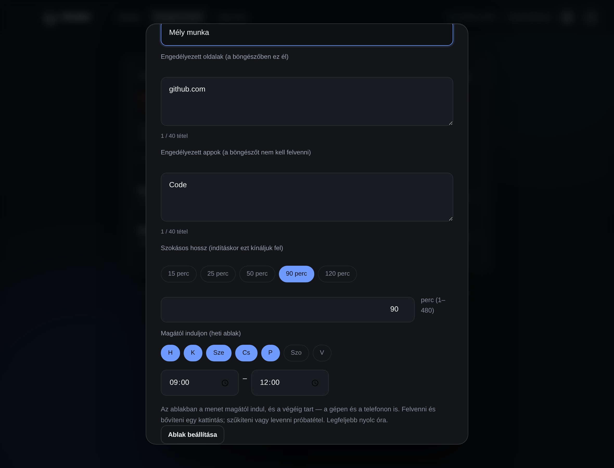

# Funkcióterv: munkamenetek („most csak ez mehet”)

Státusz: **kész az asztali appon** — csomagok, gyorsbillentyűs réteg, és a
fehérlista érvényesítése a böngészőben. Az appok engedélyezése egyelőre
figyelmeztet, nem tilt; a dokumentum alja megmondja, miért.

## Mit old meg

A blokklista arról szól, mi NE menjen. Van azonban egy másik igény, ami
ellentétes irányból közelít:

> Leülök nyelvet tanulni, és a következő ötven percben csak a szótár és a
> jegyzetfüzet kell.

Mindent felsorolni, ami zavarhat, reménytelen — a világon minden zavarhat.
Felsorolni, ami kell: öt tétel. A munkamenet ezért **fehérlista**.

```
„Nyelvtanulás”   engedve: translate.google.com, quizlet.com, Word
                 minden más: tiltva, ötven percig
```

## Hogyan indul

Az egész funkció azon áll, hogy **egy mozdulattal induljon**. Aki leül tanulni,
az nem fog előbb ablakot keresni, appot előhozni és fület váltani — addigra már
a YouTube-on van.

Ezért van egy **gyorsbillentyűs réteg** (alapból ⌘⌥B macOS-en, Ctrl+Alt+B
Windowson — a kombináció a felületről átállítható):
rááll arra, amit épp csinálsz, kilistázza a csomagokat, és számbillentyűvel
indítható. Az Esc bezárja.

A réteg **semmit nem old fel**. A leállítás gombja az appot nyitja meg, ahol a
próbatétel van — ha innen menne, a munkamenet egy billentyűkombináció lenne.

## A hossz percre pontos

Indításkor a felület felkínál néhány szokásos hosszt (15 / 25 / 50 / 90 / 120
perc), **de a szám szabadon átírható**: 1-től 480 percig bármi megadható. Ez a
rétegben is megvan, nem csak az appban — épp a sietős esetben lenne rossz, ha
csak ott lenne.

Miért nem elég a gomblista: aki tudja, hogy negyvenhárom perce van ebédig, az
eddig kénytelen volt fölé vagy alá lőni. Egy önkontroll-appnál a „nagyjából
annyi” pont a rossz irány — fölé lőve előbb akar leállítani (és az próbatétel),
alá lőve pedig magától lejár, mielőtt kész lenne.

Hosszabbítani menet közben is lehet percre pontosan. A hosszabbítás
**szigorítás** — tovább tart a munkamenet —, ezért ingyen van.

Minden csomagnak van **szokásos hossza**: indításkor ezt kínálja fel a felület.
A csomag szerkesztőjében állítható.

## Súrlódás: ugyanaz a szabály, mint mindenhol

| Művelet | Ár | Miért |
|---|---|---|
| Munkamenet indítása | ingyen | szigorítás |
| Hosszabbítás | ingyen | szigorítás |
| Csomag szerkesztése (ami NEM fut) | ingyen | nem befolyásol semmit |
| **Rövidítés** | próbatétel | lazítás |
| **Leállítás** | próbatétel | lazítás |
| **A futó csomag szerkesztése** | tiltott | lásd lent |

**A futó csomag befagy.** Enélkül a fehérlistához menet közben hozzá lehetne
adni bármit, és a munkamenet önmagát oldaná fel — csendben, próbatétel nélkül.

**Egyszerre egy munkamenet fut.** Enélkül a leállítás próbatételét meg lehetne
kerülni: indítok egy „minden engedve” csomagot, és kész.

**A végidő csak véges szám lehet.** A segéd socketjét a felhasználó nevében
futó bármely program elérheti, nem csak az app gombja. Egy szöveg (`"x"`) a
`Number()`-en át NaN lett, és mivel a `NaN < vég` hamis, a „rövidítés”
szigorításnak látszott: a menet NaN véggel íródott el — ami nem fut. Vagyis
egyetlen sor leállította, próbatétel nélkül, zárlat alatt is. Most a bíró
elutasítja (`BAD_END`), a közös szabály (`isSessionLoosening`) pedig a nem
véges véget lazításnak veszi; a valódi socketen futó teszt a szöveget, az
objektumot és az `1e999`-et (Infinity) is kipróbálja.

## Mit tud érvényesíteni, és mit nem

Ez a funkció három rétegen fekszik, és a felület mindegyiknél kimondja, mit tud:

| Réteg | Mit tud | Korlát |
|---|---|---|
| **Böngésző-bővítmény** | a fehérlista teljes érvényesítése: ami nincs a listán, oda nem enged navigálni — és a már nyitott ilyen lapot is lezárja | csak abban a böngészőben él, ahova telepítve van; vendég módban nem fut |
| **DNS (hosts)** | a meglévő blokklista végig érvényes | „mindent tilts, kivéve ötöt” egy hosts-fájlban nem leírható |
| **Appok** | a mérés látja, mi van előtérben; a böngészőnél a nyitott oldalt | egy appot bezárni nem tudunk — figyelmeztetünk, nem tiltunk |

A **böngésző az egyetlen hely, ahol a fehérlista tényleg érvényesíthető**, mert
csak ott látszik a teljes cím. A DNS a hosztnévnél tovább nem lát, és a
„blokkolj mindent, kivéve ötöt” nem írható le egy hosts-fájlban: a világ összes
tartománynevét kellene felsorolni.

Az appoknál a helyzet nyíltan gyengébb: a mérés (`tracker`) tudja, melyik app
van előtérben, de egy futó programot nem lövünk ki. Ez szándékos — egy app
kilövése adatot veszíthet, és a Breaker soha nem tesz olyat, amit a felhasználó
nem kért.

### A böngésző nem app — benne a nyitott oldal dönt

A böngésző eddig appként esett a figyelés alá: aki a csomag ENGEDETT oldalán
dolgozott, hárompercenként azt kapta, hogy a böngésző „nincs a listán” — hacsak
fel nem vette a böngészőt is az appok közé. Pedig a böngésző tároló: benne az
oldalak listája dönt, és a fehérlistát a bővítmény tartja.

Most a mérő megjelöli a böngészőt, és ha TUDJUK, mi van benne (a címe
kiolvasható volt, vagy a bővítmény jele megmondta — lásd a mérés leírását), a
menet ennél a NYITOTT OLDALT nézi (`foregroundWarning`):

- engedett oldal, új lap, a bővítmény tiltó lapja → nincs mit mondani;
- nem engedett oldal, és mégis látszik → abban a böngészőben a fehérlistát
  senki nem tartja (nincs benne bővítmény, nincs összekötve, ki van kapcsolva,
  vagy inkognitóban nem fut). A réteg ezt mondja ki, az oldal nevével.

Két fék, hogy ne állítsunk olyat, ami nem igaz: a menet indulása után egy
percig nem szólunk (a bővítmény a lehúzáskor tudja meg, hogy menet fut, és csak
azután zárhatja le a nyitott lapot), és ugyanannak az oldalnak két egymás utáni
mintán kell látszania (egy épp átirányított lap egy mintán még a régi címet
mutathatja). A türelmi idő a figyelmeztetéseké, közös az appokéval.

Ahol nem tudjuk, mi van benne (macOS-en a megtagadott engedély, és a
bővítmény sem szól), ott marad az app-szabály: ha nincs a listán, szólunk —
mert nem látjuk, mit nézel benne.

## Adatmodell

```ts
interface FocusPack {
  id: string;
  name: string;              // „Nyelvtanulás”
  allowSites: string[];      // aldomainek is átmennek
  allowApps: string[];       // részleges, kis-nagybetű-független egyezés
  defaultMinutes: number;
  recurrence?: Band;         // heti ablak: napok, kezdés, vég — magától indul
}

interface FocusRun { packId: string; startedAt: number; endsAt: number }

interface FocusLogEntry {
  packId: string;
  packName: string;          // a NÉV is, mert a csomag azóta átnevezhető
  startedAt: number;
  endedAt: number;           // mikor ért véget TÉNYLEGESEN
  plannedEndsAt: number;     // ebből látszik, hogy korábban ért-e véget
  stopped: boolean;          // próbatétellel, vagy magától járt le
  window?: boolean;          // a heti ablakból indult, magától — csak ha igaz
}
```

**Az ablak szerint indult menet kimondva:** a gépi kártya, a gyorsbillentyűs
réteg, a telefonok kártyája, az Android szűrő-értesítése és a bővítmény lapjai
egyformán mondják („a heti ablak szerint indult”) — aki nem maga indította,
tudja meg, miért fut, és hogy a vége az ablak vége.

**Menetek ablakból:** a lezárás a naplósorra írja, ha a menet a csomag heti
ablakának egy előfordulásaként indult (`isWindowRun` a három magban; csak ha
igaz — a régi sor mezőtlen, és az nem ablak). A statisztika munkamenet-blokkja
kimondja („2 menet a heti ablakból indult, magától.”), a heti mondat is („9
menet (7 ó 0 p, 2 korán leállítva, 3 ablakból)”) — mindhárom platformon: ebből
látszik, dolgozik-e az ablak, amit a csúcs-órára tettél. A mező a fiókkal
utazik (`window` a naplósoron, a drót-nevek őrével). A csomag sora is mondja
— a gépen, Androidon és iPhone-on —: „magától indul: minden nap 21:00–22:00 · a héten 3× indult magától”
(`windowRunsByPack` a három magban; a gépen a segéd adja le a státuszban,
`windowRuns7d`).

**A menet-nap:** melyik napon ülsz le a legtöbbször — négy hétből, a hét
napjaira osztva, a menet a végének napjára számít: „A négy hét menet-napja:
kedd (6 menet).” A megakadások csúcs-napjának tükre (a minta hossza és a
holtverseny szabálya közös). A statisztika munkamenet-blokkja mondja, alatta
a hét napjainak sávja a menet-nappal kiemelve, és a heti mondat is, a menetek
mondata után — mindhárom platformon (`focusByWeekday`, `Focus.byWeekday`;
a gépen a segéd adja le a statisztika-válaszban, `focusWeekdays`). Lásd
`docs/feature-usage-stats.md`.

**Amikor a csúcs-nap a menet-nap:** ha a négy hét csúcs-napja (amelyiken a kéz
a legtöbbször megakad) és a menet-napja ugyanaz, a statisztika menet-nap sora és
a heti mondat kimondja: „A csúcs-nap és a menet-nap ugyanaz: kedd — a kéz azon a napon csúszik, amelyiken le szoktál ülni.”
(`sameDayText`, `Focus.sameDayText`). Tény, nem ítélet — a csúcs-óra és a
menet-óra egybeesésének párja.

**A menet-óra:** mikor ülsz le a legtöbbször — a négy hét menetei az indulás
órája szerint: „A négy hét menet-órája: 9–10 óra (6 menet).” A csúcs-óra tükre,
alatta az órák sávja, a heti mondatban is (`focusByHour`, `Focus.byHour`;
a gépen `focusHours` a statisztika-válaszban). A menet-óra alatt a csúcs-óra
gombjának párja: heti ablak a legutóbbi csomagra a menet-óra egy órájában,
minden napra — felvenni ingyen. A menet-órában a döntés helye kimondja, hogy
most szoktál elkezdeni (a gépi kártya és a réteg, a telefonok kezdőlapja, a
böngésző lapjai), tíz perccel előtte pedig — naponta egyszer, a csúcs-óra
előjelzésének tükreként — a gép, az Android-szolgáltatás és az iPhone
emlékeztetője előre szól; ha a menet-óra a csúcs-óra, csak a csúcs-óráé szól.
Legalább három menet kell hozzá; futó menet alatt semmi sem szól. Ha egy
csomag ablaka már fedi a menet-órát, a statisztika és a heti mondat kimondja
(„magától indul: …”); ha nem fedi semmi, de lehetne rá ablakot tenni, a heti
mondat mondja: „nincs rá ablak” — a csúcs-óra fedésének tükre. Az előjelzés
értesítésén a telefonon a második gomb heti ablakot tesz a menet-órára
(Androidon `FocusWindowReceiver`, iPhone-on a `NoticeActions` ablak-gombja —
csak felvétel, a bíró dönt). És ha a menet-óra a csúcs-óra, a statisztika és
a heti mondat kimondja (`sameHourText`, `Focus.sameHourText`): a kéz akkor
jár, amikor le szoktál ülni.

**A menet-sorozat:** hány napja ülsz le minden nap — a ma (vagy ha ma még
nem, a tegnap) végződő, megszakítás nélküli napok száma, amelyeken volt
menet (a menet a végének napjára számít, mint a menet-napnál). A
statisztika munkamenet-blokkja és a heti mondat mondja, a menetek mondata
után, mindhárom platformon: „5 napja minden nap leültél.” Egy nap nem
sorozat (kettőtől szól), a megszakadt sorozat nem bűn, csak nulla — tény,
nem ítélet (`focusDayStreak`/`focusStreakText`, `Focus.dayStreak`; a gépen
a segéd adja le a statisztika-válaszban, `focusStreak`). A böngésző felugró
lapja és tiltó lapja is mondja, a menet gombja mellett — a híd adja le az app
státuszából (`suggest.focusStreak`), a lap kettőtől mondja. Ott is, ahol a
döntés van: a gépi kezdőlap javaslat-kártyája és a réteg lába, a telefonok
kezdőlapjának kártyája, és az Android szűrő-értesítés sora („· 5 napja minden nap”) — a kártya, a réteg és a
böngésző lapjai a rekordot is, a mostani sorozat mellett, zárójelben. A statisztika sora
a naplóban valaha volt leghosszabb sorozatot is mondja, ha az több a
mostaninál: „5 napja minden nap leültél (a leghosszabb sorozatod: 12 nap).”
— mostani sorozat nélkül csak a rekordot: „A leghosszabb sorozatod: 12 nap.”
(`focusLongestStreak`, `Focus.longestStreak`). A heti mondat a rekordot csak a
mostani sorozat mellett, zárójelben mondja — a hétről beszél; a puszta rekord
a statisztikáé. Őszinte korlát: a sorozat a naplóból számol — fiók nélkül
minden eszköz a sajátjából, fiókkal a közösből (a telefonon leült nap a gépen
is számít, ha a napló odaért); a menet a végének helyi napjára számít, a futó
menet csak a végén.

**Az aldomain átmegy**: a `google.com` engedése a `translate.google.com`-ot is
engedi. Enélkül minden oldalnál külön ki kellene találni, melyik aldomain kell,
és a felhasználó azt látná, hogy a beállítása nem működik. A `notgoogle.com`
viszont NEM megy át — a végén hasonlító tartománynév a leggyakoribb megkerülés.

**Az appnév lazán egyezik**, mindkét irányban: a beírt `word` engedi a
`Microsoft Word` ablakot is. Az ablakcímek és folyamatnevek gépenként és
nyelvenként eltérnek; egy pontos egyezésre épülő lista mindenkinél máshogy
viselkedne, és senki nem értené, miért.

## A napló MÁS szabályt követ, mint a többi

A szinkronban három dolog utazik együtt, és a harmadik szándékosan kilóg:

| Mi | Mi ez | Hogyan fésülődik |
|---|---|---|
| csomagok | beállítás | csomagonként: jel nélkül az újabb blob, jellel a nagyobb jel |
| futó menet | **engedély** | a szigorúbb nyer; lazítani csak a nyomával: rövidítés-számláló, lezáró naplósor |
| napló | **a múlt feljegyzése** | EGYESÍTÉS, a `rev`-hez semmi köze |

A különbség nem következetlenség. A csomagok és a futás azt mondják meg, mi
*történhet* — ezért vonatkozik rájuk a súrlódás iránya. A napló azt mondja meg,
mi *történt*: nem enged meg semmit, nem old fel semmit, és egy elveszett sora
nem kibúvó, csak pontatlan statisztika.

A napló kimarad a `rev` lenyomatából (`helper/revisions.ts`) — de benne VAN a
„van-e mit feltölteni” vizsgálatban (`sameFocus`), különben egy telefonon
lezárult menet sosem érne fel. A kettő nem ugyanaz a kérdés: az egyik azt
méri, ki dönthet, a másik azt, hogy van-e új adat.

**Egy dolgot a naplósor mégis eldönt: a menet végét.** A sor a lezárt menet
SÍRKÖVE is (lásd lent, „A futó menet a szinkronban”). Ez nem lazítás a
szabályon: sort csak az ír egy menetről, aki a menetet látta, és vagy
próbatétellel leállította, vagy kivárta a végét.

**Két sor akkor ugyanaz, ha a csomag és az EREDETI kezdés egyezik** (az
óra-ugrás eltolhatja a kezdést, a menet attól ugyanaz). Ez a gyakori eset, nem
a kivétel: a telefonon próbatétellel leállítod, a gép meg később, a
szinkronból veszi észre — enélkül minden ilyen menet kettőnek számítana.
Ütközésnél a TÖBBET TUDÓ sor marad (aki több rövidítést, aztán hosszabb tervet
ismert), azonos tudásnál a korábbi vég: a menet akkor ért véget, amikor véget
ért, nem akkor, amikor a másik eszköz észbe kapott.

## A futó menet a szinkronban: a nyom dönt, nem a számláló

Sokáig a blob `rev`-je döntött a menetről is: a nagyobb `rev`-é volt a szó,
akár a leállítás is. Egy független átnézés megmutatta, mi ezzel a baj: a
`rev`-et egy csomag átnevezése, egy kulcsszó felvétele is lépteti — ingyen.
Egy friss telepítés húsz átnevezéssel, vagy egy menet indulásakor hálózaton
kívül lévő telefon két átnevezéssel bármelyik futó menetet leállította,
próbatétel nélkül.

Most a menetről a **nyoma** dönt, mindhárom magban ugyanúgy (közös fixtúrával):

- **Menetet csak a rá hivatkozó naplósor zár le.** Aki a menetről nem tudott,
  sort sem írhatott róla — a felhúzott `rev` semmit nem ér. A sor azt a
  változatot zárja le, amit ismert: ha a menetet közben valaki
  meghosszabbította, és erről a lezáró nem tudott, a hosszabbítás túléli.
  Enélkül egy hálózaton kívül tartott eszköz lejárata ingyen visszavonná a
  hosszabbítást.
- **A rövidítésnek számlálója van** (`cuts`). Két változat ugyanarról a
  menetről: a több kifizetett rövidítés nyer, azonos számnál a hosszabb — a
  hosszabbítás ingyen van, a rövidítés nem. Egy régi, rövidítés előtti
  változat így nem írja felül a kifizetett rövidítést, és a leállítás után sem
  támad fel.
- **A menet azonossága az eredeti kezdés** (`origin`). Az alvásból ébredő gép
  eltolja a menetét (lásd lent); az eltolt menet ugyanaz a menet, tehát a
  telefon közbeni lezárásának sora rá is vonatkozik.
- **A jövőben véget ért sor nem számít** — ugyanazzal az öt perces tűréssel,
  mint az ablaknál (`FUTURE_LOG_TOLERANCE_MS`): az óra előreállításának nyoma,
  nem lezárás.
- **A futó menet csomagja mindig marad, és a fehérlistája nem bővülhet.**
  Különben ugyanaz a kiskapu a csomagon át: egy felhúzott jelű törlés (a
  csomag nélküli menetet minden fogadó eldobja) vagy bővítés (a menet alatt
  megnyílna, amit a menet zár). A csomag mezői a jelek szerinti győztesé, a
  fehérlistája a menetet hordozó változattal METSZET: a menet alatt a lista
  csak szűkülhet.

**Őszinte korlátok.**

- Ha a menetet egy eszközön meghosszabbítod, egy másikon közben próbatétellel
  rövidíted, a rövidítés nyer — a hosszabbítás elvész. Szigorítás vész el,
  nem lazítás jön; újra meghosszabbítható.
- Ha két eszközön egymásról nem tudva két KÜLÖNBÖZŐ menet indul, a szigorúbb
  marad. Ha ezt utána próbatétellel leállítod, hogy a gyengébb visszajön-e, a
  szinkron sorrendjétől függ. Mindkét kimenet ára egy kifizetett leállítás.
- Vegyes flottában (egy még nem frissített app a fiókban) a régi app
  rövidítése számláló nélkül megy fel, tehát a hosszabb változat legyőzheti.
  Frissíts minden eszközt egyszerre.

## Az óra átállítása nem rövidíti a menetet

A leállítás próbatétel — a lejárás viszont sokáig nem volt védve. Nyolc órát
előreugorva az óra a menetet „lejárttá” tette, és mivel a lejárás lépteti a
`rev`-et, a szinkron ezt a többi eszközre is átvitte.

A szabály egy mondat: **amennyi hátra volt, annyi van hátra.** Az `absorbClockJump`
a futó menet kezdését és végét is eltolja az ugrással.

Ugyanez a válasz az alvó gépre, és ez nem kompromisszum: az app nem tudja
megkülönböztetni az átállított órát a felfüggesztett géptől, de nem is kell.
Ha lecsukod a laptopot tíz perccel a vége előtt, reggel tíz perc lesz hátra —
azt a tíz percet nem töltötted fókuszban. Ugyanez igaz, ha a
háttérszolgáltatás közben nem futott: akkor a fehérlistát sem tartatta be senki.

A KEZDÉS is tolódik, nem csak a vég. Enélkül a naplóba egy ötvenperces menet
nyolc és fél órásként kerülne be.

### Az ablak-menet: a jövőben véget ért sor nem költ el

Az ablak-menet vége az ablak vége — az alvás nem tolja (lásd lent). Egy
független átnézés megmutatta, mire volt ez jó: az órát az ablak vége utánra
állítva a kör lezárta és naplózta a menetet, a visszaállítás után pedig az
ablak „elköltöttnek” látszott (a saját menete a naplóban), tehát a menet nem
indult újra. Próbatétel nélkül, zárlat alatt is, és a szinkron a többi
eszközre is elvitte.

Most a naplósor, ami a JÖVŐBEN ért véget, nem költi el az ablakot (`spentIn`,
mindhárom magban, a közös fixtúrával): ami még nem történt meg, az nem
fizetett semmit. A tűrés öt perc (`FUTURE_LOG_TOLERANCE_MS`) — két eszköz
órája ennyit eltérhet, és egy siető órájú eszköz valódi leállítása így is
elkölti. **Őszinte korlát:** ez az öt perc a nyereség felső határa; ennél
többet az óra állításával nem lehet kiváltani.

### Aminek ez az ára volt — és hogyan zárult be

Sokáig ez volt a funkció legkellemetlenebb pontja. Ha KÉT eszköz van, és az
egyik aludt, a másik ébren volt, a kettő nem ugyanazt látta:

- az ébren lévő eszköz a menetet a saját idejében lezárta, és ezzel léptette a
  szinkron-számlálót;
- az alvó eszköz ébredéskor elnyelte az ugrást, tehát nála a menet MÉG FUTOTT —
  és ez is léptetett.

Azonos `rev` mellett a szigorúbb nyer, tehát a futó menet: az ébren lévő
eszközön a menet VISSZATÉRT. Próbatétellel leállítható volt, de meglepő.

**Az első javítás: a lenyomat a futás HOSSZÁT nézi, nem az abszolút
időpontjait.** Az elnyelés nem döntés, csak helyi újraértelmezés — a
felhasználó nem csinált semmit. A kezdés és a vég ugyanannyival tolódik, tehát
a hossz VÁLTOZATLAN, és így nincs is mit léptetni. Ami valódi döntés —
meghosszabbítás, leállítás, másik csomag —, attól a hossz vagy a csomag
változik, tehát ugyanúgy léptet, mint eddig.

**Ma ez már nem a számlálón áll** (lásd fent, „A futó menet a szinkronban”):
az eltolt menet az eredeti kezdését viszi (`origin`), tehát ugyanaz a menet,
mint ami az ébren lévő eszközön lezárult — a lezárás sora rá is vonatkozik, a
hossza pedig nem több, mint amit a lezáró ismert. Az ébredő eszközön a menet
legfeljebb addig fut tovább, amíg a szinkron meg nem érkezik.

#### A formátumváltás csapdája, és miért nincs ablaka

A lenyomat a lemezen is ott van az előző verzióból. Ha a frissítés utáni első
kör vakon léptetne, az egy ÜRES eszközön azt jelentené, hogy az üres lista
1-es számlálóval és friss időbélyeggel legyőzi a gépen felvett csomagokat —
pont az a hiba, ami egyszer már majdnem megtörtént. Az „üresség nem szerkesztés”
őr itt nem véd, mert az csak akkor véd, ha a lenyomat még `undefined`.

A megoldás: a lenyomat **megmondja a saját formátumát** (`2|` előtag), és a
RÉGI algoritmus megmarad — kizárólag a váltás felismerésére. Ha a lemezen régi
alakú lenyomatot találunk, a régi algoritmussal számolunk egyet a MAI
állapotra:

- **egyezik** → azóta nem történt semmi, csak a formátum változott. Átvesszük
  az újat, léptetés nélkül;
- **eltér** → volt valódi szerkesztés, és az ugyanúgy léptet, mint bármikor.

Így a váltásnak nincs ablaka: sem egy szerkesztést nem nyel el, sem
fölöslegesen nem léptet. A régi függvényre ne épüljön semmi új — az egyetlen
dolga ez az egy döntés.

#### Ami ezzel vakfolt lett — kimondva

Ha ugyanazt a csomagot ugyanolyan hosszan leállítod és újraindítod EGY mentési
ablakon belül (~20 másodperc), a lenyomat azonos marad, tehát a számláló nem
lép. A tartalom viszont ilyenkor is felmegy, és azonos számlálónál a szigorúbb
— a később végződő — menet nyer. Ez tehát legfeljebb pár másodperc csúszás a
másik eszköz vég-időpontján, nem kibúvó.

A „szigorúbb” teljes rendezés, döntetlen nincs benne: a később végződő; azonos
lejáratnál a korábban indult (a hosszabb); ha az is egyezik, a kisebb
csomagazonosítójú. Az utolsó két lépcső ritkán dönt, de nélkülük két azonos
lejáratú menet közül az nyert volna, amelyik ELŐBB ért a kiszolgálóra — és két
gép örökké egymást írta volna felül. Egy véletlen magú fuzz-teszt
(`test/merge-fuzz.test.ts`) őrzi, hogy három eszköz bármilyen sorrendben
ugyanoda jusson.

A statisztikában maradhat egy fölös naplósor, ha az alvó eszköz a saját,
eltolt kezdésével zárja le ugyanazt a menetet: a naplósor azonossága a csomag
és a KEZDÉS párja. Nem adatvesztés, csak egy sorral több.

## Mennyi idő alatt ér el a böngészőig

A bővítmény **húsz másodpercenként** kérdezi meg az appot. Nem egy percenként,
és nem is öt másodpercenként:

- aki elindít egy munkamenetet, és utána még egy percig megnyithatja a
  YouTube-ot, az nem fog megbízni benne;
- öt másodpercenként viszont fölösleges terhelés lenne, és a munkamenet
  percekben él, nem másodpercekben.

Ez azt is jelenti, hogy a munkamenet indítása után **legfeljebb húsz
másodpercig** még átmehet egy oldal. Ezt nem takarjuk el: a réteg a szándékot
támogatja, nem egy elektromos kerítés.

### A már nyitott lap is

A tiltás eddig csak NAVIGÁLÁSKOR dőlt el: a munkamenet indulásakor már
nyitott lap nyitva maradt, a benne szóló videó ment tovább, amíg az ember
máshová nem kattintott. Most a látható lap újranézeti magát a bővítmény
hátterével — ugyanazzal a döntéssel, mint a navigáció:

- a szabályok változásakor azonnal (a bővítmény tára változott);
- amikor a lap láthatóvá válik;
- látható lapnál húsz másodpercenként — ez ébreszti a bővítmény hátterét,
  hogy az appot is megkérdezze. Enélkül egy navigálás nélkül nézett videó
  mellett a bővítmény meg sem tudná, hogy elindult egy munkamenet.

A rejtett fül nem kérdez: ami nem látszik, az nem viszi el a figyelmet, és
amikor előjön, úgyis újranéz. Az így lezárt lap nem megakadás — a könyv a
próbálkozásokat számolja, nem azt, hogy a szabály utolért egy nyitott lapot.
Ugyanez a napi keretre is áll: ha betelik, a nyitott lap is a tiltó lapra fut.

**Gépelés közben nem zárunk.** Ha az utolsó két percben gépeltél a lapon (egy
szövegmezőbe, egy szerkeszthető részbe), az újranézés nem irányít át — a
félkész szöveg elveszne, és egy futó dolgot sem zárunk le úgy, hogy adat vész
el. A lap tetején egy sáv kimondja, hogy az oldal közben lezárult, és miért; a
gépelés-csend után a lap a tiltó lapra fut. Legfeljebb tíz percig halasztható:
idő a mentésre, nem kiskapu. A számlálás a bővítmény izolált világában fut — a
weboldal kódja nem írhatja át. A navigálásnál nincs halasztás: aki elnavigál,
nem gépel.

### Inkognitóban — ha nem fut ott, az app is kimondja

A bővítmény inkognitóban alapból nem fut, és ott a munkamenet fehérlistáját
senki nem érvényesíti (az egész oldal tiltása, a DNS, igen). A bővítmény
minden lehúzáskor megmondja az appnak, fut-e inkognitóban (az
`x-breaker-incognito` fejlécben, `1` / `0`); ha nem, a munkamenet kártyája
kimondja, és megmondja, hol kapcsolható be. A régi bővítmény nem küldi: az
„nem tudni”, és akkor hallgatunk — nem állítunk olyat, amit nem tudunk. A
fejléc nevét a mag-szinkron őr veti össze a két oldalon.

## A lejárat IDŐPONT, nem állapot

A bővítmény a munkamenet végét **helyben** nézi, nem az apptól kérdezi:

- ha az appot bezárják, a munkamenet a saját idejéig **akkor is tart** —
  bezárni az appot nem feloldás;
- de egy perccel sem tovább: egy elérhetetlen app nem tarthat bent örökre.

## Mi valósult meg, hol

| Rész | Hol |
|---|---|
| Mag (fehérlista, idő, súrlódás iránya) | `desktop/src/shared/focus.ts` |
| Tárolás | `desktop/src/helper/state.ts` |
| Bíró (indítás, hosszabbítás, leállítás) | `desktop/src/helper/referee.ts` |
| Felület (csomagok, futó munkamenet) | `desktop/src/renderer/renderer.ts` |
| Gyorsbillentyűs réteg | `desktop/src/main/overlay.ts`, `renderer/overlay.*` |
| A gyorsbillentyű átállítása | `desktop/src/shared/shortcut.ts`, `main/overlay-shortcut.ts` |
| A fehérlista kiadása a bővítménynek | `desktop/src/main/rules-bridge.ts` |
| A fehérlista érvényesítése | `extension/background.js`, `extension/app-link.js` |
| Összefésülés eszközök között | `desktop/src/shared/sync/focus-merge.ts` + Kotlin/Swift tükör |
| Napló és összegzés | `desktop/src/shared/focus.ts` (`closeIfEnded`, `summarizeFocus`) |
| Statisztika a felületen | `renderer.ts`, `ui/StatsScreen.kt`, `App/StatsView.swift` |
| Heti ablak (magától induló menet) | `focus.ts` (`occurrenceAt`, `dueRecurrence`, `isWindowRun`), `referee.ts` (`setFocusRecurrence`, `tick`), `Focus.kt` / `Focus.swift` + a `Referee` tükrök köre |

## Ami még hátra van

- [ ] Az appok tényleges tiltása (ma figyelmeztetés), platformonként külön
- [ ] Rendszerszintű fehérlista weboldalakra: ehhez helyi DNS-feloldó kell,
      nem hosts-fájl
- [x] A gyorsbillentyű átállítható a felületről (lásd lent)

## A gyorsbillentyű átállítása

A kombináció eddig be volt égetve (⌘⌥B / Ctrl+Alt+B), és ha egy másik
program elvette, a réteg némán nem nyílt — a felület csak annyit tudott
mondani, hogy foglalt. Mostantól a Munkamenetek kártyán **rögzítő mód** van:
Módosítás, aztán a következő lenyomott kombináció lesz az új; Esc visszalép,
az Alapértelmezett gomb visszaállít.

A szabályok egy helyen élnek (`desktop/src/shared/shortcut.ts`), tesztekkel,
mert két helyen kétféleképp eldőlve pont a csendes hibát szülnék:

- **kombináció** = legalább egy valódi módosító (⌘/Ctrl vagy Alt) és pontosan
  egy billentyű (betű, szám, F1–F12, szóköz). A csupasz betű és a Shift+betű
  gépelés, nem parancs — egy ilyen regisztráció minden szövegmezőt elrontana;
- a fő módosító platformonként más (⌘ macOS-en, Ctrl Windowson), de ugyanaz
  az elmentett érték (`CommandOrControl`) mindkét rendszeren ugyanazt jelenti;
- az elmentett szöveg is bemenet: sérült vagy kézzel átírt érték esetén az
  alapértelmezés áll vissza, nem a semmi.

Az átállítás csak akkor marad meg, ha a regisztráció **tényleg sikerült**;
sikertelen kísérlet után a régi kombináció áll vissza, és a felület kimondja,
ha az sem a miénk. Őszinte korlát: egy másik program által elvett
kombinációt elvenni nem tudunk, csak elkerülni — ezért van az átállítás.

## Heti ablak: a menet magától indul

> A statisztika a csúcs-órából egy kattintással ajánl ablakot: „Heti ablak a
> csúcs-órára” — a legutóbbi csomagra, minden napra, a csúcs egy órájában.
> A telefonokon is: ott a gomb csak felvesz (ablakos csomagon nincs), cserélni
> és levenni a gépen lehet. Lásd `docs/feature-usage-stats.md`.

A munkamenet egy mozdulattal indul — de a mozdulatot az embernek kell
megtennie, és pont a nehéz reggeleken nem teszi meg. A csomag ezért kaphat
egy **heti ablakot** („hétköznap 9:00–12:00”): az ablakban a menet magától
indul, és az ablak végéig tart — a gépen és a telefonon is, mert az ablak a
csomaggal együtt szinkronizál.

A sáv-alak ugyanaz, mint az oldalak menetrendjében (napok, kezdés, vég;
éjfélen átnyúlhat), és legfeljebb nyolc óra — egy huszonnégy órás „ablak” nem
munkamenet lenne, hanem egy kikapcsolhatatlan fehérlista.



### Súrlódás: ugyanaz a szabály

| Művelet | Ár | Miért |
|---|---|---|
| Ablak felvétele | ingyen | szigorítás |
| Bővítés (több nap, hosszabb ablak) | ingyen | szigorítás |
| **Szűkítés, eltolás** | próbatétel | a régi ablak egy perce szabad lenne |
| **Levétel** | próbatétel | lazítás |
| **A futó csomag ablaka** | tiltott | a futó csomag befagy |
| **A fehérlista bővítése, amíg az ablak áll** | tiltott — előbb az ablak levétele | 8:59-kor a youtube.com a kilences ablak alá ugyanaz, mint az ablak levétele |
| **Az ablakos csomag törlése** | tiltott — előbb az ablak levétele | törölni és újra felvenni ablak nélküli csomagot adna |

A lazítás kérdését ugyanaz a percenkénti mintavétel dönti el, mint a
menetrendnél: van-e olyan perc a következő héten, amikor a régi ablak
indítana, az új nem. Az ablak **külön gombbal** megy a csomag szerkesztőjében,
nem a Mentés része: a Mentés ingyenes út, és a segéd a mentésnél a tárolt
ablakot meg is tartja — különben a Mentés lenne a kikapcsoló. Ugyanezért a
Mentés az ablakos csomag fehérlistáját **csak szűkíteni** engedi (kevesebb
cím, kevesebb app — az átnevezés és a hossz szabad), és a Törlés gomb sem
törli: a kapu az ablak levétele, egyszer, próbatétellel — utána minden
ingyen.

Ha a levétel próbatétele alatt ér be az ablak, a segéd elindítja a menetet —
a próbatétel teljesítése **azt a menetet is lezárja** (a naplóban
leállítottként), mert az ára ugyanaz. A közben kézzel indított menetet nem
bántja: azt a felhasználó indította, annak a leállítása külön próbatétel.

### Az ablak az ígéret, nem a hossz

A menet kezdése **mindig az ablak kezdete**, akkor is, ha az eszköz később
ébredt. Ez nem esztétika: így minden eszköz UGYANAZT a menetet állítja elő
(csomag + kezdés), a szinkron a kettőt egynek látja, és a napló egy sort kap.
Ha a gép 9:30-kor ébred, a menet 9:00-tól 12:00-ig szól — a telefon ugyanezt
tartatta be 9:00 óta.

Ugyanezért az **óra-ugrás elnyelése az ablak-menetet nem tolja el**: a délben
végződő ablak délben végződik, nem tolódik a laptop alvásával. A kézi menetnél
a hossz az ígéret („amennyi hátra volt, annyi van hátra”), az ablaknál az
időpont. A meghosszabbított ablak-menet már kézi menetnek számít.

### A napló az őr

A leállítás próbatétel — de mi akadályozza meg, hogy a következő kör egy perc
múlva újraindítsa? **A napló.** A leállított (vagy lerövidített) menet sora az
ablak SAJÁT menete — a kezdése az ablak kezdése —, és amíg ilyen sor van, az
ablak nem indít újra. A napló szinkronizál, tehát a másik eszköz sem. Másnap
az ablak tiszta lappal indul. Csak a saját menet számít: a csomag kézzel
indított menete az ablakon belül — akár egyperces, a kör tizenöt másodperces
résében elkapva — nem fogyasztja el az ablakot; amikor véget ér, az ablak
menete indul. Az ablak ELŐTT kézzel indított menet sem: az a saját idejében
ér véget, az ablak hátralévő része jár.

Egyszerre egy menet fut — de egy heti ablak attól még **rárétegződik**. Ha az
ablak kezdetén épp egy **másik** csomag menete megy, az NEM ér véget: amíg az
ablak tart, csak az mehet, amit **mindkét** csomag enged (`effectivePack`: az
oldalaknál pontos metszet az aldomain-szabállyal — a `google.com` és a
`translate.google.com` metszete a `translate.google.com` —, az appoknál a laza
app-egyezés miatt csak közelítés; az appot a gép úgyis csak jelzi). Amikor a
futó menet véget ér, és az ablakból még van hátra, az ablak menete indul —
onnan, ahol a másik véget ért (`windowRunFor`), az ablak végéig. Az azonossága
akkor is az ablak kezdete (`origin`): ablak-menet marad, és a leállítása
ugyanúgy elkölti az ablakot.

Korábban az ablak a kezdetén lezárta a futó menetet, és ez rés volt: ablakot
felvenni ingyen van (szigorítás), így egy most kezdődő, kétperces ablak egy
laza csomagra próbatétel nélkül véget vetett egy kétórás menetnek — a lezárás
sora pedig a szinkronnal minden eszközön leállította. Még korábban az ablak
várt, és az is rés volt: egy 8:59-kor indított, nyolcórás laza menet az egész
ablakot kiváltotta. A rárétegződés mindkettőt zárja, egyik sem enged a
másikból. Az indító párbeszéd mindhárom platformon előre kimondja, ha egy
másik csomag ablaka a következő nyolc órában indul; a kártya, a réteg, az
androidos sáv és az iPhone kártyája kimondja, ha egy ablak most
rárétegződik, és mi mehet. Külön leállítani a rárétegződést nem lehet: a futó
menet leállítása csak a menetet állítja le, utána az ablak menete jön, és
annak a leállítása külön próbatétel — két vállalás, két ár. A saját csomag
kézi menete mellett az ablak nem rétegződik (az ugyanaz a fehérlista), és
amikor véget ér, az ablak hátralévő része indul.

A gépen az app **értesítést dob**, amikor az ablak menete feltűnik — akkor is,
ha az app később nyílt meg, mint ahogy a menet indult. Aki nem maga indította,
tudja meg, miért van minden zárva, és meddig. A kézzel indított menet nem szól:
azt a felhasználó indította. Engedély híján a kártya és a felső sori jelzés
mondja ugyanezt. A felugró lapon és a tiltó lapon egy gomb is: „Munkamenet:
Nyelvtanulás, 25 perc” a hídon indítja az app javasolt csomagját
(`POST /focus_start`, a kóddal — a bíró dönt; futó menet és összekötés nélkül
nincs gomb; a tiltó lap kimondja, hogy elindult). Mellette a másik gomb —
„Heti ablak a csúcs-órára: Nyelvtanulás, minden nap 21:00–22:00” — a hídon
felteszi az ablakot (`POST /focus_window`), ha az app csúcs-óráját semmi nem
fedi és a csomagnak nincs még; csak felvétel, a csere az appé. A böngészőben is ott van: a bővítmény felugró lapja és a
tiltó lapja kimondja, ha a menet az ablak szerint indult — a híd viszi át a
jelet a többi adattal együtt, és egy régebbi app, ami nem küld ilyet, nem
ablak, hanem sima menet.

### Őszinte korlátok

- Egy eszköz, ami a leállítás idején nem volt hálózaton, a szinkron
  megérkezéséig újraindíthatja a menetet az ablak hátralévő részére. A hiba
  iránya a szigorúbb, és a leállítás ott is ugyanaz a próbatétel.
- A naplóban az ablak menete az ablak kezdetétől áll (9:00–12:00), nem attól,
  hogy melyik eszköz mikor volt ébren. Ha előtte az ablakban egy másik menet
  futott — vagy UGYANANNAK a csomagnak a kézi menete nyúlt át az ablak
  kezdetén (8:30–9:30) —, az ablak menete ott kezdődik, ahol az véget ért
  (9:30–12:00), hogy a statisztika ne számolja kétszer ugyanazt az időt. Ha
  egy másik eszköz az előző menetről nem tudott időben, és az ablak
  kezdetétől indította, a szinkron a kettőt egy menetnek látja (az azonosság
  az ablak kezdete), és a hosszabb változat marad — ilyenkor az átfedés
  megmaradhat. Egy kis többlet a statisztikában, nem kibúvó.
- A csomaglista egy blobban utazik, de **csomagonként** fésülődik: minden
  felvétel, szerkesztés és törlés jelet kap (a blob változat-számát), és
  csomagonként a nagyobb jel dönt. Így ha a gépen most vettél fel egy
  ablakot, és a telefon ugyanabban a körben — még a régi listával —
  elindított egy menetet, az ablak megmarad, a telefon menete is. Jel nélkül
  (régi kliens) az újabb blob dönt, ahogy régen; amíg a fiókban régi kliens
  is van, a csomag oda-vissza járhat — frissítés után rendeződik.
- Az óraátállítás éjszakáján a három platform ugyanazt a szabályt követi:
  a kétszer előforduló falióra-idő (ősszel a 2:00–2:59) az ELSŐ
  előfordulás, a kihagyott (tavasszal a 2:xx) az átállás előtti eltolással
  olvasva, vagyis egy órával később. Ez a JS szabálya; a Java naptára
  magától a második előfordulást adta (egy 2:30-as ablak az Androidon egy
  órával később indult, két naplósorral), a Foundation verziónként
  máshogy dönt — ezért a Kotlin és a Swift mag kimondva követi. A
  `fixtures/dst-cases.json` Europe/Budapest időzónában őrzi, a 2026-os
  tavaszi és őszi éjszakán. Más időzónák szabálya ugyanez, de a fixtúra
  csak ezt az egyet nézi.
- A telefonon az ablakot a DNS-útvonal köre nézi, tizenöt másodpercenként; az
  indítás legfeljebb ennyit késhet. A gépen a segéd köre pár másodperc.
- A telefon a csomagot indítja és betartatja, és fel is tud venni újat (név,
  engedett oldalak, alap-hossz) — az új csomag a következő körben a gépre is
  megérkezik, jellel, tehát a gép egyidejű szerkesztése nem nyeli el. A
  szerkesztés, a törlés és a heti ablak beállítása a gép dolga, ahol a csomag
  szerkesztője is van; a telefon csak hozzáad, mint az ablaknál.
- A gépen a segéd az ablak menetét akkor is elindítja, ha az app nem fut, és
  a böngésző is betartja (lásd lent, „Az ablak a böngészőben, app nélkül”).
  A rések: amit az app utolsó szava óta máshol levettél, azt a böngésző az
  app következő indulásáig még betartja; egy hétnél tovább zárva tartott app
  után a további ablakokról nem tud. Mindkettő a szigorúbb irány, vagy
  pontosan a régi viselkedés. A telefon szűrője ettől független.

### Az ablak a böngészőben, app nélkül

A gépen a fehérlistát egyedül a böngésző-bővítmény tudja betartani, és ő a
hídon, az apptól tud a menetről. Eddig ezért a heti ablak a böngészőben csak
futó app mellett élt: az app bezárása — semmi próbatétel — az ablak
feloldása volt a böngészőben, holott a segéd a menetet közben elindította.

Most az app minden lehúzásnál a heti ablakok **következő hetét** is leküldi
(`upcomingWindows`, a segéd állapotából; az elköltött — leállított vagy
lefutott — előfordulás nélkül), a bővítmény tárolja, és a döntés két
forrásból áll össze (`effectiveFocus` az `extension/app-link.js`-ben):

- **amíg az app friss** (az utolsó sikeres lehúzás legfeljebb egy perce
  volt — három lehúzásnyi idő), az app élő szava dönt. Ő tudja, hogy egy
  ablak menetét kifizetett próbatétellel leállították; ha a tárolt lista
  ilyenkor is élne, a leállítás a böngészőben nem érne semmit;
- **ha az app hallgat**, a most tartó tárolt ablakok is érvényesek, és —
  mint a segédben — rárétegződnek a tárolt futó menetre: a lista a menet
  SAJÁT csomagjának (a híd ezt külön leküldi, `packAllowSites`) és a most
  tartó ablakoknak a metszete (`intersectSites`). Menet nélkül az elsőként
  kezdődő ablak a menet, a többi arra rétegződik. Az ablak után a futó menet a
  saját listájával tart, a saját idejéig — egy azóta véget ért ablak
  szűkítése nem ragad rá. (Régi app a saját listát nem küldi: akkor a tárolt,
  már metszett lista az alap — szigorúbb, nem lazább.)

A lista egy hétre szól, legfeljebb 64 előfordulás; a bővítmény a rosszul
formált tételt eldobja (régi app válaszában nincs ilyen mező — az üres lista,
nem hiba). Tesztek: a kiszállított `effectiveFocus` és `focusAllows` a
`desktop/test/extension-focus.test.ts`-ben, a tárolás a
`desktop/test/extension-storage.test.ts`-ben, a valódi böngészőben a
`desktop/scripts/extension-e2e.js` (régi lehúzás + most tartó ablak → tiltó
lap, az ablak nevével; friss „nem fut” → nem tilt).

**Az indulás előtt a lap szól.** Ugyanebből a tárolt listából a bővítmény azt
is tudja, hogy két percen belül indul egy ablak: ha a nyitott lap nincs a
csomagban, a tetején egy sáv mondja („Munkamenet indul 2 perc múlva
(Nyelvtanulás) — ez az oldal nincs benne, akkor zárul.”) — a zárás ne
félbehagyott mondat közepén érjen. Futó menet mellett is szól, ha a lapot
az most engedi: az ablak egy MÁSIK csomag menetére rárétegződik, és ami eddig
ment, de az ablak nem engedi, figyelmeztetés nélkül zárulna. Ha a futó menet
nem engedi a lapot, az már zárva; a csomag saját menete mellett pedig a két
lista ugyanaz, tehát nincs miről szólni (`focusStartingSoonFor`, tesztekkel;
a zárás előtti sáv többi fajtáját lásd az `extension/README.md`-ben).

### Tíz perccel előtte értesítés is jön

A zárlat-ablak beérése előtt az app eddig is szólt tíz perccel; a heti ablak
menete szó nélkül indult — pedig az is lezár mindent, ami nincs a csomagban,
és ami épp nyitva van, félbemarad. Most mindhárom platformon jön egy
értesítés tíz perccel előtte:

> **Breaker — mindjárt indul a munkamenet**
> Nyelvtanulás: 10 perc múlva indul a heti ablak szerint, 18:50-ig. Amíg
> tart, csak a csomagban felsoroltak mehetnek — ami nyitva van, mentsd el.

A döntés a magé (`windowRunStartingSoon`, a három nyelven ugyanaz — a
`fixtures/focus-cases.json` `soon` szakasza a határokon is őrzi: a pont tíz
perc még szól, egy ezredmásodperccel több már nem, a kezdés pillanata már
nem előjelzés). Ami már tart, arról nem szól; a csomag saját futó menete
mellett sem (az ablak mellé úgysem indul új menet); az elköltött
előfordulásról sem. Egy MÁSIK csomag menete nem hallgattatja el — az ablak
arra rárétegződik, és ami eddig ment, de az ablak nem engedi, zárulni fog,
tehát pont erről kell szólni. Egy előfordulásról egyszer szól.

- **A gépen** a segéd mondja meg (az állapot `focusWindowSoon` mezője, a
  naplóval együtt döntve), a felület szól — ha az értesítés engedélyezve van.
- **Androidon** a szűrő köre szól, saját csatornán („Heti munkamenet”), hogy
  külön is elnémítható legyen.
- **iPhone-on** az app nem fut a háttérben, ezért a rendszer szól: az app
  hetente ismétlődő emlékeztetőt ütemez minden ablakos nap kezdése elé
  (`Focus.windowReminderPlan`). A rendszer 64 függő kérést enged egy appnak;
  a zárlat-ablaké az elsőbb, a menetek előjelzése abból kap, ami utána marad
  — és ha nem fér be mind, egy sem kerül fel: egy félig ütemezett hét
  (hétfőn szól, csütörtökön nem) rosszabb a kimondott hiánynál. Őszinte
  határ: előre ütemezett, tehát akkor is szól, ha a csomag menete épp
  kézzel fut.

## A telefon eddig kiskapu volt

A munkamenet a v0.4.2-ig **csak az asztali appban létezett**. Elindítod a gépen
a „Nyelvtanulás” csomagot, aztán felveszed a telefont — és ott minden mehet.
Egy fehérlistánál ez nem részleges lefedettség, hanem a funkció fele: pont az
az eszköz maradt ki, ami kéznél van.

A mag ezért mostantól **három nyelven** él (`Focus.kt`, `Focus.swift`), és a
`scripts/check-core-sync.js` őrzi, hogy a számai ne csússzanak szét.

### Telefonon a fehérlista ERŐSEBB, mint gépen

Ez meglepő, de így van, és a mechanizmusból jön:

| | Amit a réteg lát | Fehérlista? |
|---|---|---|
| **hosts fájl (gép)** | egy statikus névlista | **nem** — a világ összes nevét kellene felsorolni |
| **böngésző-bővítmény (gép)** | a teljes URL | igen, de csak abban a böngészőben |
| **VPN/alagút (telefon)** | **minden névfeloldás** | **igen** — bármire tud nemet mondani |

A telefonon tehát nem kell bővítmény: a szűrő minden lekérdezést lát, és ami
nincs a csomagon, arra NXDOMAIN a válasz.

### Ezért kell a kivétellista — és ezért szűk

Egy telefon, aminek MINDEN névfeloldása elhasal, nem korlátozott telefon,
hanem használhatatlan: nem jön értesítés, a rendszer azt hiszi, nincs
internet, és a felhasználó a munkamenetet fogja hibásnak tartani, nem a saját
beállítását.

A kivételek tételesen, indoklással (`Focus.INFRA_ALLOW`):

| Mi | Miért |
|---|---|
| értesítés-kézbesítés (FCM / APNs) | enélkül nyolc órán át nem jön üzenet — a munkamenet nem arról szól, hogy elérhetetlen legyél |
| kapcsolat-ellenőrzés | enélkül a rendszer hálózati hibát jelez, és a felhasználó „nincs net”-et lát, nem munkamenetet |
| óra (NTP) | egy elcsúszott óra a munkamenet VÉGÉT is elcsúsztatná |
| a saját fiókkiszolgálód | enélkül a telefon nem látná, ha egy MÁSIK eszközön leállítod — egy zár, amit a saját kulcsod sem ér el, nem zár |

Böngészni egyiken sem lehet. A felület kimondja, hogy a lista létezik: egy
titkos kivétel rosszabb lenne, mint egy nyílt.

**A listát gépi ellenőrző őrzi** (`scripts/check-infra-allow.js`), mert ez az
EGYETLEN szándékos lyuk a fehérlistán, és VÉGZŐDÉS szerint illeszkedik: egy
`google.com` a `mtalk.google.com` helyett az egész tartományt megnyitná. Az
ellenőrző azt nézi, hogy a lista szűk MARADJON — legfeljebb tizenkét tétel,
legalább három címke, egyik sor se fedje le a másikat. Azt nem tudja
megítélni, hogy egy bejegyzés indokolt-e; az emberi bírálat marad.

**Az utolsó sor KIVÉTEL a szigor alól, és ezt kimondjuk.** A fiókkiszolgáló
címét a FELHASZNÁLÓ adja meg, tehát elvben bármi lehet — aki oda a
`youtube.com`-ot írja, a munkamenet alatt megnyitja magának a YouTube-ot.

Nem zárjuk be, mert az ára a funkció: a telefon enélkül nem tudná meg, hogy
egy másik eszközön leállítottad a menetet, és egy nyolcórás menetből ott nem
lenne kiút. A kibúvónak viszont valódi ára van — aki így tesz, elveszíti a
szinkronját, vagyis a közös blokklistát és a közös napi keretet is.

Ez ugyanabba a fiókba tartozik, mint a rendszer VPN-kapcsolója: nem
elfelejtett rés, hanem kimondott, költséges kiút. A Breaker önkontroll-eszköz,
nem felügyeleti szoftver — aki elszántan meg akarja kerülni, meg tudja. A
dolgunk az, hogy ez soha ne legyen KÉNYELMESEBB, mint végigcsinálni a
próbatételt.

### A sorrend, ami nem esztétika

`Focus.verdict` a döntés, és a sorrendje maga a szabályrendszer:

1. **A blokklista mindig nyer.** A munkamenet sosem old fel semmit — csak
   hozzátesz. Ha ez fordítva lenne, egy csomagba felvett `youtube.com`
   feloldaná a tiltott YouTube-ot, próbatétel nélkül: a munkamenet lenne a
   kiskapu a blokklistán.
2. Nem fut munkamenet → a blokklista döntött.
3. A csomagon rajta van → mehet.
4. Rendszer-infrastruktúra → mehet.
5. Minden más → tiltva, mert a munkamenet fehérlista.

Az 1. pontot külön teszt őrzi, és a tesztet elrontva ellenőriztem, hogy
tényleg elhasal.

### Amit az appoknál a telefon NEM tud

A csomag `allowApps` mezőjét a telefon **nem érvényesíti**. Androidon a
rendszer-alagút appok szerinti szűrése külön mechanizmus (`addAllowedApplication`),
iOS-en pedig egyáltalán nincs ilyen. A mezőt mégis tároljuk és szinkronizáljuk,
mert a gépen érvényes, és a szinkron sosem dobhat el olyat, amit egy eszköz nem
használ — különben a telefon minden körben letörölné a gépen felvett listát.

## Hol tart most a mobil (v0.4.4)

| | Csomagok tárolása | Szinkron | Fehérlista érvényesítése | Indítás | Statisztika |
|---|---|---|---|---|---|
| **Gép** | igen | igen | böngésző-bővítmény | igen | igen |
| **Android** | igen | igen | **DNS-szűrő (a VPN-ben)** | igen | **igen** |
| **iPhone** | igen | igen | **DNS-szűrő (az alagútban)** | igen | **igen** |

A statisztika oszlopa a v0.4.4-ben lett teljes. Addig a napló csak a gépen
létezett, holott a menetet a telefonon is le lehetett zárni: aki ott ült le
dolgozni, azt látta, hogy a héten egyszer sem.

iPhone-on ez az EGYETLEN idő-statisztika, ami valaha igazi lesz. Az Apple nem
enged hozzáférést ahhoz, mennyi időt töltesz más appokban — a munkamenet
viszont a miénk: mi indítjuk, mi zárjuk le, mi írjuk a naplót. Androidon pedig
a mérési hozzáférés KAPUJA FÖLÖTT áll, ugyanezért: nem az Androidtól kérjük.

**Mindkét telefonon indítani és leállítani is lehet — EGYSZERRE került be a kettő.**
Ez nem esztétika: indítani ingyen van, leállítani viszont próbatétel. Ha a
telefon tudna indítani, de leállítani nem, akkor egy elindított nyolcórás
menetből ott nem lenne kiút — és a Breaker soha nem tesz a felhasználóval
olyat, amit az nem kért. Ezért a `startFocus` és a `changeFocus` mindkét
platformon egy lépésben jött, a próbatétel-motorral együtt.

A csomagokat továbbra is a **gépen** állítod össze: ott látszik a teljes lista,
és ott kényelmes gépelni. A telefon indítja és betartatja őket.

Kiút emellett is van, és nem titok: a rendszer VPN-kapcsolója erősebb az
appnál. Ha ott kikapcsolod az alagutat, a szűrés megáll — a blokklistánál is
így van.

## Amit ez a réteg NEM fed

- **Az appok listáját** (`allowApps`) a telefon nem érvényesíti. Androidon az
  alagút appok szerinti szűrése külön mechanizmus, iOS-en pedig egyáltalán
  nincs ilyen. A mezőt mégis tároljuk és szinkronizáljuk, mert a gépen érvényes.
- **A tényleges alagút-viselkedés** csak igazi készüléken derül ki. A CI a
  logikát fedi (magok, összefésülés, számlálók), és a fordítást — de VPN-t nem
  futtat. Ezt nem hallgatjuk el: a „minden letesztelve” itt pont annyira lenne
  igaz, mint a hamis biztonságérzet, ami ellen az egész app szól.

## A három mag ugyanazt számolja a naplóból

A menetek naplója a szinkronon utazik; a statisztika és a heti mondat belőle
számol mindhárom platformon: a hét és az előző hét összegzője, a menet-nap, a
menet-óra, a sorozat és a leghosszabb sorozat, az ablakból indult menetek
csomagonként, a napi rajz. A `fixtures/merge-cases.json` napló-szekciója (írja
`desktop/test/merge-fixture.test.ts`) véletlen naplókat tart — a mai naphoz
húzott és három hétre szórt sorok, jövőbeli és nagyon régi sor, korai és késői
vég, ablakból indult menet, három csomag holtversenyre —, és a gép számait; a
Kotlin (`MergeFixtureTest`) és a Swift (`MergeFixtureTests`) ugyanazt számolja.
A leggyakoribb csomag holtversenyben az először látott, mindhárom magban. A
napkulcs helyi időben jár, ezért a három teszt UTC-ben — a gép és az Android
beállítja, a Swift beállítja, vagy ha nem tudja, kimondva kihagyja.

## A munkamenet magja ugyanaz mindhárom platformon

Az ismétlődő menet (a csomag heti ablaka) minden eszközön MAGÁTÓL indul: a
bíró minden körben megkérdezi, melyik ablak esedékes. Ha a három mag más
előfordulást számolna, vagy két egyszerre esedékes ablak közül mást
választana, a menet az egyik eszközön elindulna, a másikon nem — vagy más
csomaggal. A `fixtures/focus-cases.json` (írja
`desktop/test/focus-fixture.test.ts`, `UPDATE_FOCUS_FIXTURE=1 npm test`) ezt
kérdezi, UTC-ben: minden csomag mostani előfordulását (a sáv szélein, perc
pontosan, éjfélen átnyúló és egész napos sávval, érvénytelen sávokkal is), az
esedékes ablakot (futó saját és másik menet, elköltött és nem elköltött ablak,
két egyforma ablak holtversenye — a kisebb azonosító nyer, KÓDEGYSÉG szerint,
mint a gépen; az iPhone eddig a Swift `<`-ét használta), hogy a futó menet
ablak-menet-e, a rárétegződést (az összes most esedékes ablak, a futó menet
hatásos csomagja — a metszet oldalra és appra, egy törölt csomag menete
mellett nincs ilyen —, és az ablak menete, ha most indulna: ott, ahol az
előző menet véget ért, az ablak kezdetének azonosságával), a lezárást a 200
soros napló vágásával, a legutóbb használt
csomagot (egyforma kezdésnél az első a naplóban — az iPhone eddig a nem
garantáltan stabil `sorted`-ra hagyatkozott), a hátralévő idő szövegét és a
percek tisztítását. A Kotlin (`FocusFixtureTest`) és a Swift
(`FocusFixtureTests`) ugyanezt játssza vissza.

A percek tisztítása egy valódi eltérést fogott: a dróton jött csomag
hárommilliárdos `defaultMinutes`-e a gépen a 480 perces plafonra vágódott, az
Androidon a `toInt()` negatívra fordította, és az alapértelmezett 25 lett
belőle (az iPhone `Int(...)`-je egy Int-be nem férő számon összeomlott volna).
Most mindhárom előbb vág, és csak utána alakít.

Az engedélyezett appok neve is a fiókon utazik, és a fogadó oldal is
újratisztítja — a szöveg-fixtúra (`fixtures/text-cases.json`) most ezt is nézi:
a gép a fedőnév sor-tisztítását kapta (a közös szóköz-készlet, kódpontos
vágás), az Android Java-regexe eddig csak az ASCII szóközt ismerte, az iPhone
grafémában vágott és a BOM-ot nem ismerte. Az app-egyezés (melyik ablak mehet
egy menet alatt) a közös szélek szerint vág, a gép kisbetűjével (a szó végi
szigmával), és kódegységre keres (a Swift `contains` grafémában és kanonikus
egyenértékűséggel keresett). És egy szigorítás: az üres tétel nem enged
mindent — a `includes('')` minden appra igaz volt.

A csomag neve ugyanígy egy szabályt kapott (`normalizePackName`, és a
naplósorra `logPackName`): a közös sor-tisztítás, legfeljebb 40 KÓDPONT, a
szóköz-futam egy szóköz. Eddig három volt: a gép a széleket vágta és UTF-16
egységben vágott — egy iPhone-on felvett hosszú, emodzsis nevet félbe vághatott
egy emodzsin, és a párja nélküli fél a fiókon át visszajutott az iPhone-ra,
ahol az olvasó az egész munkamenet-dokumentumot eldobja —, az Android a
Kotlin `trim`-jével (a BOM-ot nem ismeri) és szintén UTF-16-ban, az iPhone
grafémában vágott. A felvételkor az Android csak a szóközt, a tabot és a
sorvéget vonta össze, az iPhone a saját szóköz-fogalmával, a gép semmit. Most
a felvétel és a fogadás ugyanazt teszi mindhárom magban (a mentett állapot
olvasása a gépen és Androidon is), és a szöveg-fixtúra kimondja. A név mezője
a telefonokon is a 40. karakternél áll meg, mint a gépen — eddig a telefon
többet engedett beírni, és a felvétel csendben levágta. A naplósort az iPhone
eddig se nem vágta, se az üres nevét nem pótolta, se az azonosító nélküli sort
nem dobta el — most a gép `normalizeLogEntry`-jét tükrözi.
